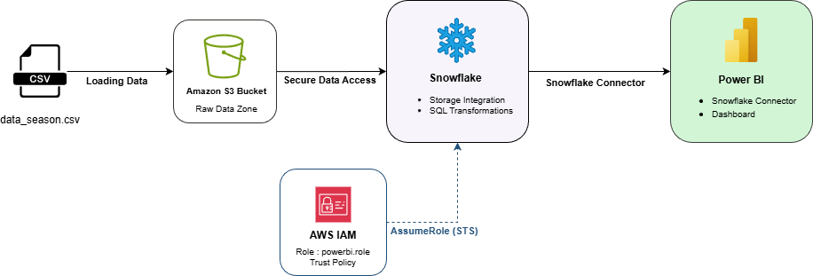
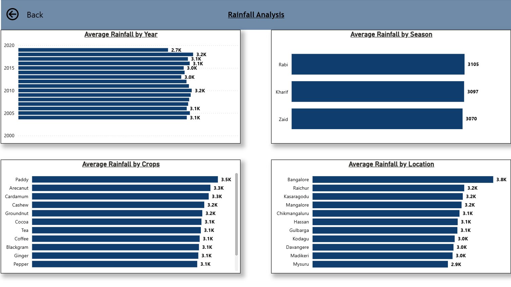
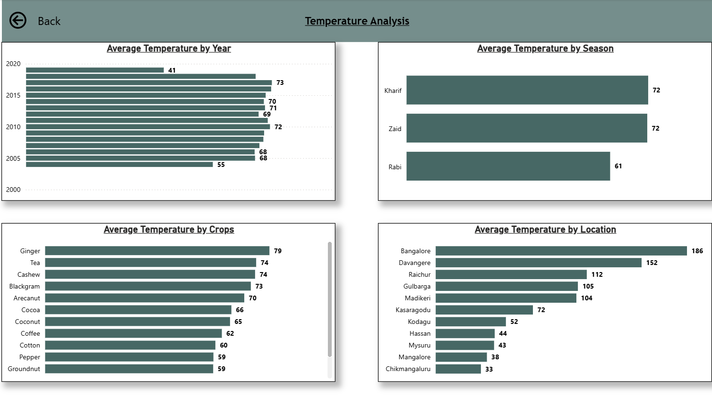
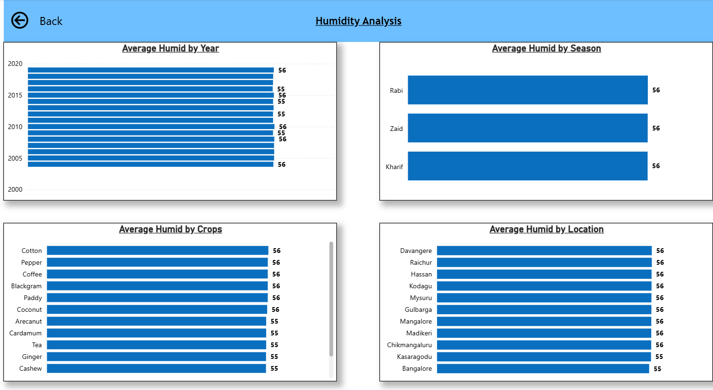
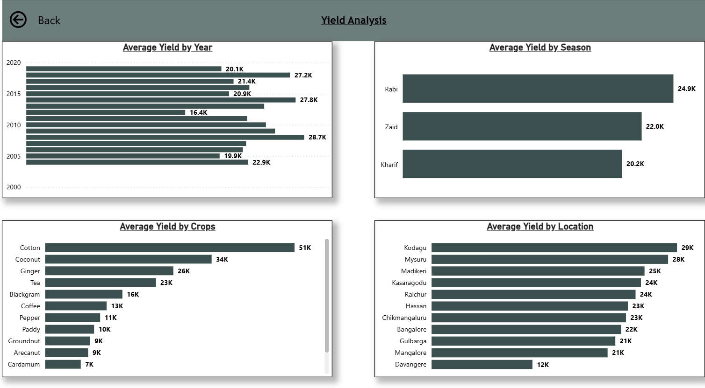

# AWS–Snowflake–Power BI Analytics Project

## Overview

This project demonstrates an end-to-end data analytics pipeline using cloud storage, a data warehouse, and business intelligence tools.

## Tech Stack

- AWS S3 (data storage)
- AWS IAM (role-based access)
- Snowflake (data warehousing & SQL)
- Power BI (data visualization)

## Project Structure

```text
├── aws/           # IAM policies and S3 setup guide
├── snowflake/     # SQL scripts for integration, loading, and transformation
├── powerbi/       # Power BI dashboard files (.pbix)
├── data/          # Raw data sample files
└── images/        # Architecture diagrams
```

## Architecture

S3 → Snowflake (Storage Integration & IAM Role) → Power BI

## Pipeline Flow

1. Raw data files are uploaded to Amazon S3.
2. Secure access is configured using an IAM role and trust policy.
3. Snowflake uses a storage integration to load data from S3.
4. Data is transformed using SQL inside Snowflake.
5. Power BI connects to Snowflake for dashboard creation.

## Architecture



## Security Considerations

- IAM role-based access is used instead of static credentials.
- Snowflake accesses S3 via a storage integration and trust policy.
- All SQL scripts are sanitized before being uploaded to GitHub.
- No sensitive credentials or account identifiers are stored in the repository.

## Power BI Dashboard

### Dashboard Overview


### Rainfall Analysis



### Temperature Analysis



### Humidity Analysis



### Yield Analysis



## Status

🚧 Project in progress – Snowflake transformations and Power BI dashboards under development.
